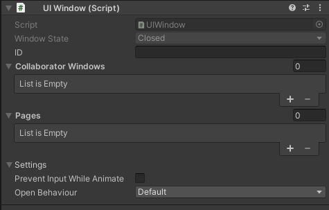
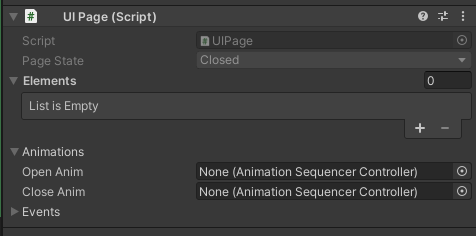
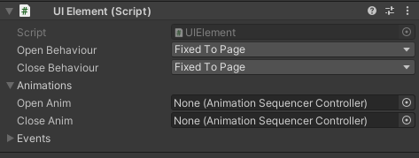

# UI System
[](https://unity3d.com/get-unity/download)

## Description

A flow base ui system that controls relative ui windows.

## Table of Contents

* [Installation](#installation)
* [Using](#using)

## System Requirements

This package is dependent to these third party packages:
* [Naughty Attributes](https://github.com/dbrizov/NaughtyAttributes)
* [Unity Animation Sequencer](https://github.com/brunomikoski/Animation-Sequencer)

## Installation
This package is hosted on the github and can be installed via git url
```
https://github.com/SerkanAtaman/UI-System.git
```
> **Note**
> Be aware that you first have to install dependent packages to be able to install this package

# Overview

## using

### Creating UI System

1. Add FlowController instance to your scene

2. Create flow database asset for newly created FlowController.

> **Note**
> You can create a flow database asset by going 'Create/SeroJob/UiSystem/FlowDatabase'

4. Fill the 'Windows' reference of FlowController using the [UIWindow](#uiwindow) you have created.

### UIWindow

A base class that represent one part of the game ui. For example 'LevelCompletedWindow'.

> **Note**
> A UIWindow requires a canvas component to operate normally.

An empty ui window component looks like this:



* UIWindow requires a unique string id to be defined correctly.
* The main purpose of UIWindow is to handle it's [UIPage](#uipage) activity. It does not do or render anything by itself.
* Single [UIWindow](#uiwindow) can contain multiple [UIPages](#uipage).

### UIPage

A base class that represent one part of a UIWindow.

> **Note**
> A UIPage can not operate without a UIWindow parent.

An empty UIPage component looks like this:



* A UIPage has to be child of the UIWindow object.
* Every UIPage have to contain both opening animation and closing animation.
* UI animations are represents by [Unity Animation Sequencer](https://github.com/brunomikoski/Animation-Sequencer).
* There is no restriction about what a UIPage can do. Their functionality can be constructed as desired.
* As an option, UIPages can contain as many [UIElements](#uielement) as required.

### UIElement

Represent a minor ui object as a part on an [UIPage](#uipage).

> **Note**
> A UIElement can not operate without a UIPage parent.

An empty UIElement component looks like this:



There are 3 pre-defined UIElement open behaviours ready to use without additional effort:
* **FixedToPage**
	* Represent that UIElement has no unique animations or function conditions. With this type of open behaviour, UIElement will act like a static part of the UIPage and will be placed in canvas according to it's page
* **AnimateWithPage**
	* Represent that UIElement has a unique open animation and it will be start playing **after** it's page's opening animation starts playing.
* **AnimateAfterPage**
	* Represent that UIElement has a unique open animation and it will be start playing **after** it's page's opening animation finishes playing.
* **Manuel**
	* When this option selected, while it's page starts opening UIElement will not respond it automatically. It's totaly up to developer to define it's open behaviour. This can be done either creating a custom script that inherits from UIElement or proving methods to it's page's events to run custom methods to animate the element.


There are 3 pre-defined UIElement close behaviours ready to use without additional effort:
* **FixedToPage**
	* Represent that UIElement has no unique animations or function conditions. With this type of close behaviour, UIElement will act like a static part of the UIPage and will be placed in canvas according to it's page
* **AnimateWithPage**
	* Represent that UIElement has a unique close animation and it will be start playing **after** it's page's closing animation starts playing.
* **AnimateBeforePage**
	* Represent that UIElement has a unique close animation and it will be start playing **before** it's page's closing animation starts playing.
* **Manuel**
	* When this option selected, while it's page starts closing UIElement will not respond it automatically. It's totaly up to developer to define it's close behaviour. This can be done either creating a custom script that inherits from UIElement or proving methods to it's page's events to run custom methods to animate the element.

## License

Copyright (c) NjoyKidz Oyun Yazilim ve Pazarlama AS. All rights reserved.
